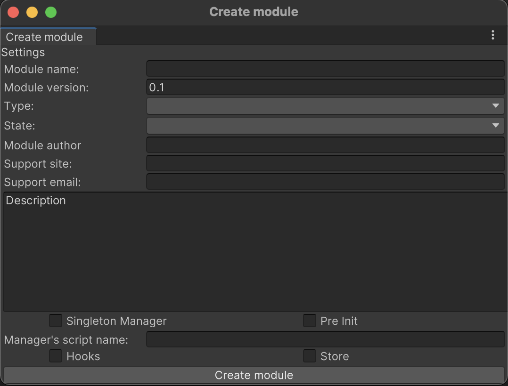

# Создание нового модуля

Модули можно добавлять как вручную, так и используя редактор Unity.

## Создание модуля с помощью редактора Unity

 Идем в меню: Window/ZFramework/Create Module <br>
 Откроется окно:
 

- <b>Module name:</b> Осмысленно название модуля на английском, без пробелов и начиная с заглавной буквы (использовать принцип наименования классов как в C#). Например: InnAppPurchases или Match3GameBoard или AudioSystem и т.д. Не может быть пустым.
- <b>Module version:</b>Пишется номер версии для дальнейшей синхронизации и версионности (0.9.1 или 0.1 или 1.0 и т.д.)
- <b>Type:</b>Тип модуля System или Domain - соотвественно данный модуль будет создан в соотвествующей папке Modules/System или Module/Domain
- <b>State:</b> Состояние в котором сейчас находится модуль. Существуют следующие состояния:
- - Not completed - не завершен
- - Alpha
- - Beta
- - Stable
- - Migrated - код перенесен из другой игры и как-то адаптирован (но могут быть косяки).
- - MigrateNotNormalAdapted - совсем не адаптирован (может быть много косяков)
- <b>Module author:</b> Автор модуля. Может быть пустым.
- <b>Support site:</b> Сайт автора модуля или сайта куда можно обратиться за поддержкой. Может быть пустым.
- <b>Support email:</b> Почта автора модуля или почта куда можно написать и обратиться за поддержкой. Может быть пустым.
- <b>Description:</b> Краткое описание того, что делает модуль.
- <b>Singleton manager:</b> Требуется ли глобальный менеджер, через который будут общаться скрипты модуля. Через App.НазваниеМодуляManager (Например: App.AudioSystem)

- <b>PreInit:</b> Нужна ли какая-то преинициализация для модуля. В классе менеджера будет объявлена функция PreInit и вызвана в Modules/System/00_InitializationCycle/Z0_PreInit.cs
- <b>Manager's script name:</b> Имя, которое будет использовано для менеджера модуля. Если оставить пустым, имя будет следюущим: НазваниеМодуля + Manager.
- <b>Hooks:</b> Добавлять ли файл с хуками (если планируется внедрять новые глобальные хуки в проект). Обратите внимание: Добавление глобальных хуков может вести к увеличение связности модулей. Данная архитектурная особенность была унаследована от прошлого проекта. В дальнейшем может быть изменена.
- <b>Store:</b> Добавлять ли файл с модель данных. Данные модели, которые описаны в этом файле попадут в Глобальное хранилище данных.

 ## Создание модуля вручную
Чтобы создать новый модуль вручную, необходимо добавить папку либо в Modules/System, либо в Modules/Domain с названием вашего модуля.
Модуль может состоять из любого количества файлов и папок. Но основное что он должен содержать это:
1. Файл с менеджером (через который мы будем получать доступ к функционалу модуля)
2. Файл с моделью данных. Данный файл должен иметь имя модуля + Store. Например InnAppStore.cs
3. Файл с глобальными хуками, если такой потребуется.

Файлу с менеджером всегда сопутствует файл с название: Модуль + Parts (Например: InnAppManager.cs и InnAppManagerParts.cs)

В InnAppManagerParts.cs идет расширение глобального partial класса App:
```c#
using System.Collections;
using System.Collections.Generic;
using UnityEngine;

namespace ZFramework
{
    public partial class App : MonoBehaviour
    {
        public static ModuleNameManager ModuleNameManager;
    }
}
```
А менеджер InnAppManager.cs должен содержать в себе 2 функции и наследоваться от SingletonCrossScene<T>:
```c#
namespace ZFramework
{
    public class ModuleNameManager : SingletonCrossScene<ModuleNameManager>
    {
        /// <summary>
        /// Функция предварительной инициализации
        /// </summary>
        public void PreInit()
        {
            RegisterStaticObject();
        }

        /// <summary>
        /// Регистрирует (создает и инициализирует) глобальную статик переменную, чтобы у нас был доступ к стору из любого участка кода.
        /// Реализуется паттерн синглтона (потокобезопасный).
        /// </summary>
        public void RegisterStaticObject()
        {
            App.ModuleNameManager = ModuleNameManager.Instance();
        }
    }
}
```
Таким образом, к функционалу модуля можно будет обратиться 2 способами:
1. App.ModuleNameManager
2. ModuleNameManager.Instance()

Первый способ предпочтительнее. Для сохранения целостности API проекта. Хотя никто не запрещает использовать и 2 способ, тогда, нет необходимости в Parts файле и в целом PreInit().

Если менеджера (синглтона) нет на сцене, он автоматически создается, поэтому думать об этом не нужно, система сама распознает и разместить на сцену все необходимое и когда надо уничтожит. Этот функционал потокобезопасен, так что переживать, что случайно будет создано 2 синглтона тоже не стоит.

Мета данные модуля храняться в файле module-info.json, он выглядит следующим образом:
```json
{
    "hash": "b442110feeb252a7f97b79070fd6bdfd",
    "name": "ServerManager",
    "custom_manager_name": "ServerManager",
    "version": "0.5",
    "author": "",
    "site": "",
    "email": "",
    "type": 0,
    "state": 90,
    "description": "Модуль для взаимодействия с сервером.",
    "preinit": true,
    "critical": false,
    "dependencies": [],
    "utils": [],
    "plugins": []
}
```
Подробное описание каждого из полей смотрите в пункте "Создание модуля с помощью редактора Unity".

Если нам нужны глобальные хуки, то нам необходимо создать файл с названием модуля + Hooks. Например: InnAppHooks.cs.
Там нужно расширеть глобальный partial класс App следующим образом:
```c#
using System.Collections;
using System.Collections.Generic;
using UnityEngine;

namespace ZFramework
{
    public partial class App : MonoBehaviour
    {
        public static Hook OnNewHookName;
    }
}

```
Хуков может быть сколь угодно много. Обратите внимание: Добавление глобальных хуков может вести к увеличение связности модулей. 


Чтобы описать модели данных и хранить эти данные в глобальном хранилище, нам нужно создать файл с названием модуля + Store. Например: InnAppStore.cs

И там нужно расширить класс GSHelp. 
```c#
using System.Collections;
using System.Collections.Generic;
using UnityEngine;

namespace ZFramework
{
    public static partial class GSHelp // InnAppStore
    {
        public static int IntVar;

        public class InnAppConf 
        {
            public static string Server;
            public static bool Active;
        }
    }
}
```

Который при инициализации проекта, переберается рефлексией и извлекает и создает переменные в глобальном хранилище. А сам класс GSHelp необходим для автокомплита в среде разработки. Так чтобы получить необходимую переменную, может делать так:
App.Get<int>(GSHelp.IntVar) а затем просто удалить "GSHelp." и взять в кавычки переменную App.Get<int>("IntVar") так вы не ошибетесь и не нужно помнить точные названия всех переменных.

Также в глобальном хранилище можно инкапсулировать данные используя встроенные классы и обращаясь к ним следующим образом:
App.Get<string>(GSHelp.InnAppConf.Server) а затем просто удалить GSHelp. и взять в кавычки оставшееся, заменив точку на слеш App.Get<string>("InnAppConf/Server")