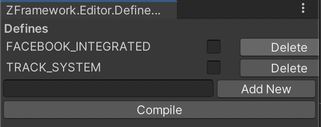

# Глобальные определения

У движка есть глобальные определения.

Чтобы открыть их, нужно пройти в меню: Window/ZFramework/Global Define Inspector  
Вы увидите окно: 

Соответственно ставя и снимая галочки напротив мы по сути активируем или деактивируем соотвествующий #define.

Они нужны, для интегрированных плагинов. Например мы добавили плагин для связи с фейсбук. И чтобы выгружать движок в новые проекты и он работал без плагина фейсбук (для тестов), то весь зависимый код мы помещаем под данные дефинишены (это позволяет не беспокоиться за написание оберток для изменений и внедрений)

